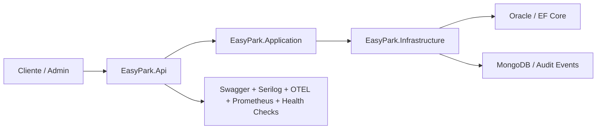

# EasyPark .NET API - Sprint 4

## Integrantes

- Gabriel Cruz Ferreira — RM559613
- Kauã Ferreira dos Santos — RM560992
- Vinicius da Silva Bitú — RM560227

## Visão geral

O **EasyPark** é uma API REST em **ASP.NET Core 8** para gestão de estacionamentos, vagas, reservas, pagamentos e jobs operacionais.  
Nesta entrega do sprint 4 o projeto foi consolidado com:

- **Clean Architecture** com projetos separados para `Domain`, `Application`, `Infrastructure` e `Api`.
- **Oracle + EF Core** como persistência relacional oficial.
- **MongoDB** para auditoria/eventos de sensores e operações relevantes.
- **JWT Bearer** com papéis `Admin` e `Cliente`.
- **Swagger/OpenAPI**, **HATEOAS**, **health checks**, **OpenTelemetry**, **Prometheus** e **Serilog**.
- **Testes unitários e de integração** com `xUnit`.

## Arquitetura

### Estrutura da solução

- `easypark-net/EasyPark.Domain`: entidades e exceções de domínio.
- `easypark-net/EasyPark.Application`: DTOs, contratos, serviços de aplicação e regras de acesso.
- `easypark-net/EasyPark.Infrastructure`: `DbContext`, repositórios EF Core, JWT, auditoria Mongo e migrações.
- `easypark-net/EasyPark.Api`: controllers, middleware, health checks, observabilidade e bootstrap HTTP.
- `easypark-net/tests/EasyPark.UnitTests`: testes de Domínio e Aplicação.
- `easypark-net/tests/EasyPark.IntegrationTests`: testes HTTP ponta a ponta com `WebApplicationFactory`.

### Diagrama



## Funcionalidades entregues

### API e segurança

- CRUD e busca de `Estacionamentos`, `Vagas`, `Reservas` e `Pagamentos`.
- Endpoints de autenticação:
  - `POST /api/auth/register`
  - `POST /api/auth/login`
- JWT Bearer com claims de `sub`, `email` e `role`.
- Autorização por perfil:
  - `Admin`: operações administrativas, consultas amplas e jobs.
  - `Cliente`: reservas e pagamentos autenticados.
- Restrições de dono do recurso em `Reservas` e `Pagamentos`.

### Paginação, ordenação, filtros e HATEOAS

- Busca paginada em:
  - `GET /api/estacionamentos/search`
  - `GET /api/vagas/search`
  - `GET /api/reservas/search`
  - `GET /api/pagamentos/search`
  - `GET /api/auditoria/eventos-sensor`
- HATEOAS aplicado nos endpoints de consulta por ID e busca paginada.

### Persistência

- Oracle como banco relacional oficial.
- Repositórios concretos para:
  - `Estacionamento`
  - `Vaga`
  - `Reserva`
  - `Pagamento`
  - `Usuario`
- Migração inicial em:
  - `easypark-net/EasyPark.Infrastructure/Migrations/20260524175122_InitialSprint4.cs`
- MongoDB para auditoria com os campos:
  - `Id`
  - `OccurredAt`
  - `EventType`
  - `EntityType`
  - `EntityId`
  - `UserId`
  - `CorrelationId`
  - `PayloadJson`
  - `Source`

## Endpoints principais

| Método | Rota | Descrição |
|---|---|---|
| `POST` | `/api/auth/register` | Registra usuário e retorna JWT |
| `POST` | `/api/auth/login` | Autentica e retorna JWT |
| `POST` | `/api/estacionamentos` | Cria estacionamento |
| `GET` | `/api/estacionamentos/{id}` | Consulta estacionamento com HATEOAS |
| `GET` | `/api/estacionamentos/search` | Busca paginada de estacionamentos |
| `POST` | `/api/vagas` | Cria vaga |
| `GET` | `/api/vagas/{id}` | Consulta vaga com HATEOAS |
| `GET` | `/api/vagas/search` | Busca paginada de vagas |
| `GET` | `/api/vagas/{id}/status` | Consulta status da vaga |
| `GET` | `/api/estacionamentos/{estacionamentoId}/vagas` | Lista vagas por estacionamento |
| `POST` | `/api/reservas` | Cria reserva |
| `GET` | `/api/reservas/{id}` | Consulta reserva com HATEOAS |
| `GET` | `/api/reservas/search` | Busca paginada de reservas |
| `PUT` | `/api/reservas/{id}` | Atualiza reserva |
| `DELETE` | `/api/reservas/{id}` | Remove reserva |
| `POST` | `/api/pagamentos` | Cria pagamento |
| `GET` | `/api/pagamentos/{id}` | Consulta pagamento com HATEOAS |
| `GET` | `/api/pagamentos/search` | Busca paginada de pagamentos |
| `POST` | `/api/jobs/reservas/timeouts` | Executa job de timeout de reservas |
| `POST` | `/api/jobs/prereservas/timeouts` | Executa job de timeout de pré-reservas |
| `POST` | `/api/jobs/reservas/{id}/eta` | Atualiza ETA da reserva |
| `GET` | `/api/auditoria/eventos-sensor` | Busca eventos de auditoria |
| `GET` | `/api/auditoria/eventos-sensor/{id}` | Consulta evento de auditoria |
| `GET` | `/health/live` | Liveness |
| `GET` | `/health/ready` | Readiness com Oracle, Mongo e serviço externo |
| `GET` | `/health` | Health consolidado |
| `GET` | `/metrics` | Métricas Prometheus |

## Configuração

### Pré-requisitos

- `.NET SDK 8`
- Oracle Database acessível
- MongoDB acessível para a auditoria completa

### Variáveis e appsettings

Exemplos importantes:

```powershell
$env:ConnectionStrings__Default = "User Id=SEU_USUARIO;Password=SUA_SENHA;Data Source=HOST:PORTA/SERVICO"
$env:Jwt__Issuer = "EasyPark.Api"
$env:Jwt__Audience = "EasyPark.Client"
$env:Jwt__SecretKey = "uma-chave-grande-e-segura"
$env:Mongo__ConnectionString = "mongodb://localhost:27017"
$env:Mongo__DatabaseName = "easypark"
```

Se `Mongo:ConnectionString` não for informado, a API usa auditoria em memória e o health check de Mongo responde como `Degraded`. Para a avaliação final, configure Mongo real.

## Como executar

### Restaurar dependências

```bash
cd easypark-net
dotnet restore
dotnet tool restore
```

### Aplicar migrações

```bash
dotnet tool run dotnet-ef database update --project EasyPark.Infrastructure --startup-project EasyPark.Infrastructure
```

### Subir a API

```bash
dotnet run --project EasyPark.Api.csproj
```

Swagger em ambiente de desenvolvimento:

- `http://localhost:<porta>/swagger`

## Observabilidade

- `Serilog` no console e em `logs/easypark-.log`
- `CorrelationId` via header `X-Correlation-ID`
- `OpenTelemetry` com export console e OTLP opcional
- `Prometheus` em `/metrics`
- `ProblemDetails` padronizado para `400`, `401`, `403`, `404`, `409` e `500`

## Aderência ao Sprint 4

| Requisito | Evidência no projeto |
|---|---|
| Clean Architecture | Projetos separados em `Domain`, `Application`, `Infrastructure` e `Api` |
| SOLID e Clean Code | Controllers delegam para serviços; contratos e repositórios ficam na camada de aplicação |
| Injeção de Dependência | Configurada em `Program.cs` e `EasyPark.Infrastructure/DependencyInjection.cs` |
| Exceções globais | Middleware `GlobalExceptionMiddleware` com `ProblemDetails` |
| API RESTful | Controllers para autenticação, estacionamentos, vagas, reservas, pagamentos, jobs e auditoria |
| Swagger/OpenAPI | Configurado com autenticação Bearer JWT |
| Paginação, ordenação e filtros | Endpoints `/search` e auditoria aceitam `page`, `pageSize`, `sortBy`, `sortDir` e filtros por domínio |
| HATEOAS | Envelopes `ResourceDto<T>` e `PagedResourceDto<T>` com links de navegação |
| JWT/Auth | `POST /api/auth/register`, `POST /api/auth/login` e roles `Admin`/`Cliente` |
| EF Core + Oracle | `EasyParkContext`, provider Oracle e migration inicial |
| MongoDB | Repositório `MongoAuditEventRepository` para eventos de auditoria |
| Repository Pattern | Repositórios concretos em `EasyPark.Infrastructure/Repositories` |
| Health Checks | `/health/live`, `/health/ready` e `/health` |
| Logging e observabilidade | Serilog, `CorrelationId`, OpenTelemetry e Prometheus |
| Testes | xUnit com testes unitários e de integração |
| Documentação | README com arquitetura, endpoints, instalação, testes, observabilidade e integrantes |

## Testes

Executar tudo:

```bash
dotnet test easypark-net/EasyPark.sln
```

Cobertura:

```bash
dotnet test easypark-net/EasyPark.sln --collect:"XPlat Code Coverage"
```

Status atual da suíte:

- `33` testes unitários
- `7` testes de integração
- Cobertura unitária atual:
  - `EasyPark.Domain`: `98,56%`
  - `EasyPark.Application`: `75,79%`
