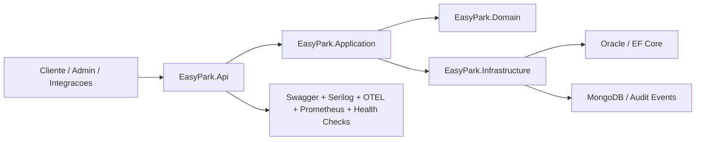

# EasyPark .NET API - Sprint 4

## Integrantes

- Gabriel Cruz Ferreira - RM559613
- Kaua Ferreira dos Santos - RM560992
- Vinicius da Silva Bitu - RM560227

## Visao geral

O **EasyPark** e uma API REST em **ASP.NET Core 8** para operacao de um ecossistema de estacionamento com multiplos sites, regras de reserva antecipada, leitura de sensores, processamento de pagamento e monitoramento operacional.

O problema de negocio tratado pela aplicacao nao e apenas cadastrar vagas. O sistema precisa controlar a jornada completa de uso:

1. o usuario escolhe um estacionamento e uma vaga elegivel;
2. a aplicacao cria uma **pre-reserva** com base nas regras de antecedencia e tolerancia do estacionamento;
3. o sistema acompanha o **ETA** do cliente e pode converter a pre-reserva em **reserva** quando a chegada entra na janela permitida;
4. o sensor da vaga confirma a ocupacao real e o fluxo passa para **ocupada**;
5. ao final do uso, o pagamento e registrado e a reserva e encerrada;
6. jobs e regras automaticas tratam atrasos, no-shows, expiracao e trilhas de auditoria.

Nesta entrega do sprint 4 o projeto foi consolidado com:

- **Clean Architecture** com separacao em `Domain`, `Application`, `Infrastructure` e `Api`.
- **Oracle + EF Core** como persistencia relacional oficial.
- **MongoDB** para auditoria e eventos operacionais.
- **JWT Bearer** com perfis `Admin` e `Cliente`.
- **Swagger/OpenAPI**, **HATEOAS**, **health checks**, **OpenTelemetry**, **Prometheus** e **Serilog**.
- **Testes unitarios e de integracao** com `xUnit`.

## Regras de negocio principais

### Estacionamentos e endereco

- Cada estacionamento pertence a uma operadora e usa um endereco completo em hierarquia `UF -> Cidade -> Bairro -> Endereco`.
- O cadastro de estacionamento concentra parametros operacionais usados nas reservas:
  - `EsperaMinutos`
  - `ToleranciaMinutos`
  - `LimiteNoShow`
  - `MaxAntecedenciaMinutos`
  - `MaxAntecedenciaMinutosSuspenso`
- Esses parametros definem a janela permitida de chegada, o comportamento de timeout e restricoes para usuarios com historico ruim.

### Vagas, niveis e sensores

- O estacionamento possui niveis, e cada nivel possui varias vagas.
- Cada vaga pertence a um tipo com tarifa por minuto e pode estar ativa ou inativa.
- O status operacional da vaga pode ser enriquecido por sensores e eventos de telemetria.
- A disponibilidade real de uma vaga depende tanto do cadastro quanto do estado da reserva e dos eventos de sensor.

### Reservas

- O fluxo de reserva segue a linha de negocio do DER e das sprints anteriores:
  - `PRE_RESERVA`
  - `RESERVA`
  - `OCUPADA`
  - `PAGA`
  - `CANCELADA`
- A pre-reserva representa a intencao do usuario antes da janela efetiva de chegada.
- A reserva efetiva bloqueia a vaga na janela operacional correta.
- A ocupacao e confirmada pelo uso real da vaga e pelos eventos operacionais.
- Timeouts podem cancelar pre-reservas e reservas que ultrapassarem a janela configurada.
- O sistema deve impedir concorrencia indevida de uso da mesma vaga e proteger o acesso do usuario apenas aos proprios recursos, salvo perfil administrativo.

### Pagamentos

- O pagamento e vinculado a uma reserva e registra dados do pagador e do cartao de forma segregada.
- O sistema guarda informacoes suficientes para auditoria e conciliacao, sem transformar pagamento em simples campo agregado da reserva.
- O encerramento financeiro compoe o fechamento do ciclo operacional da reserva.

### Usuarios, perfil e suspensao

- O usuario autentica por email e senha.
- O campo `PERFIL` define autorizacao por papel:
  - `Admin`: operacoes administrativas, consultas amplas e jobs.
  - `Cliente`: reservas e pagamentos autenticados.
- O modelo de usuario no DER tambem suporta comportamento de suspensao, no-shows e controle temporal de restricao.

## Arquitetura

### Estrutura da solucao

- `easypark-net/EasyPark.Domain`: entidades, enums, excecoes de dominio e regras invariantes.
- `easypark-net/EasyPark.Application`: DTOs, contratos, servicos de aplicacao, autorizacao e regras de orquestracao.
- `easypark-net/EasyPark.Infrastructure`: `DbContext`, configuracoes EF Core, repositorios concretos, JWT, MongoDB, migracoes e adaptadores de observabilidade.
- `easypark-net/EasyPark.Api`: controllers HTTP, middleware global, Swagger, health checks e bootstrap da aplicacao.
- `easypark-net/tests/EasyPark.UnitTests`: testes das camadas de Dominio e Aplicacao.
- `easypark-net/tests/EasyPark.IntegrationTests`: testes ponta a ponta com `WebApplicationFactory`.

### Diagrama da solucao



### Como as camadas se relacionam

- A API concentra apenas preocupacoes HTTP, autenticacao, serializacao e middleware.
- A camada de aplicacao orquestra os casos de uso e acessa persistencia apenas por interfaces.
- A camada de dominio representa as entidades e regras centrais do negocio.
- A infraestrutura implementa detalhes de persistencia, JWT, auditoria e integracoes.
- O acesso ao banco relacional passa por **Repository Pattern** e coordenacao transacional.

## Modelo de dominio

O modelo de dados segue o DER do projeto e cobre operacao, localizacao, auditoria e cobranca.

- `OPERADORA`: empresa dona de um ou mais estacionamentos.
- `ESTACIONAMENTO`: unidade operacional com parametros de espera, tolerancia e no-show.
- `NIVEL`: divisao fisica do estacionamento.
- `TIPO_VAGA`: classificacao funcional e tarifaria da vaga.
- `VAGA`: vaga fisica com tipo, nivel e condicoes de ativacao.
- `SENSOR` e `SENSOR_EVENTO`: origem da telemetria operacional.
- `VAGA_STATUS`: cache de status atual da vaga.
- `USUARIO`: autenticacao, perfil e regras de suspensao.
- `RESERVA`: fluxo principal de uso da vaga.
- `RESERVA_PRECO`: snapshot financeiro da reserva.
- `RESERVA_HIST`: historico de transicoes e origem do evento.
- `PAGAMENTO`, `PAGAMENTO_PAGADOR` e `PAGAMENTO_CARTAO`: encerramento financeiro e dados do pagador.
- `UF`, `CIDADE`, `BAIRRO` e `ENDERECO`: normalizacao de localizacao e endereco.

## Funcionalidades entregues

### API e seguranca

- CRUD e busca de `Estacionamentos`, `Vagas`, `Reservas` e `Pagamentos`.
- Endpoints de autenticacao:
  - `POST /api/auth/register`
  - `POST /api/auth/login`
- JWT Bearer com claims de `sub`, `email` e `role`.
- Autorizacao por perfil e restricao de dono do recurso para reservas e pagamentos.
- Tratamento global de excecoes com payload padronizado em `ProblemDetails`.

### Busca, filtros e HATEOAS

- Busca paginada em:
  - `GET /api/estacionamentos/search`
  - `GET /api/vagas/search`
  - `GET /api/reservas/search`
  - `GET /api/pagamentos/search`
  - `GET /api/auditoria/eventos-sensor`
- Ordenacao e filtros por campos de dominio.
- HATEOAS aplicado nos endpoints de consulta por ID e consulta paginada.

### Persistencia relacional e NoSQL

- Oracle como banco relacional oficial.
- Repositorios concretos para `Estacionamento`, `Vaga`, `Reserva`, `Pagamento` e `Usuario`.
- Migracao inicial em:
  - `easypark-net/EasyPark.Infrastructure/Migrations/20260524175122_InitialSprint4.cs`
- MongoDB para auditoria com os campos:
  - `Id`
  - `OccurredAt`
  - `EventType`
  - `EntityType`
  - `EntityId`
  - `UserId`
  - `CorrelationId`
  - `PayloadJson`
  - `Source`

### Observabilidade

- `Serilog` com logs estruturados.
- Correlacao por `CorrelationId`.
- `OpenTelemetry` para traces e exportacao OTLP.
- `Prometheus` em `/metrics`.
- Health checks em `/health`, `/health/live` e `/health/ready`.

## Ciclo de vida operacional da reserva

1. **Pre-reserva**: o usuario escolhe a vaga e informa a antecedencia desejada.
2. **Janela de chegada**: a aplicacao compara a intencao do usuario com as regras do estacionamento.
3. **Conversao em reserva**: quando a janela operacional e atingida, a vaga pode ser bloqueada para aquele usuario.
4. **Ocupacao real**: eventos de sensor e operacoes de negocio consolidam a ocupacao da vaga.
5. **Pagamento**: o uso e encerrado com registro do pagamento associado.
6. **Timeout e auditoria**: jobs e eventos geram historico, cancelamentos e rastreabilidade.

## Endpoints principais

| Metodo | Rota | Descricao |
|---|---|---|
| `POST` | `/api/auth/register` | Registra usuario e retorna JWT |
| `POST` | `/api/auth/login` | Autentica e retorna JWT |
| `POST` | `/api/estacionamentos` | Cria estacionamento |
| `GET` | `/api/estacionamentos/{id}` | Consulta estacionamento com HATEOAS |
| `GET` | `/api/estacionamentos/search` | Busca paginada de estacionamentos |
| `POST` | `/api/vagas` | Cria vaga |
| `GET` | `/api/vagas/{id}` | Consulta vaga com HATEOAS |
| `GET` | `/api/vagas/search` | Busca paginada de vagas |
| `GET` | `/api/vagas/{id}/status` | Consulta status da vaga |
| `GET` | `/api/estacionamentos/{estacionamentoId}/vagas` | Lista vagas por estacionamento |
| `POST` | `/api/reservas` | Cria reserva |
| `GET` | `/api/reservas/{id}` | Consulta reserva com HATEOAS |
| `GET` | `/api/reservas/search` | Busca paginada de reservas |
| `PUT` | `/api/reservas/{id}` | Atualiza reserva |
| `DELETE` | `/api/reservas/{id}` | Remove ou cancela reserva conforme regra aplicavel |
| `POST` | `/api/pagamentos` | Cria pagamento |
| `GET` | `/api/pagamentos/{id}` | Consulta pagamento com HATEOAS |
| `GET` | `/api/pagamentos/search` | Busca paginada de pagamentos |
| `POST` | `/api/jobs/reservas/timeouts` | Executa job de timeout de reservas |
| `POST` | `/api/jobs/prereservas/timeouts` | Executa job de timeout de pre-reservas |
| `POST` | `/api/jobs/reservas/{id}/eta` | Atualiza ETA da reserva |
| `GET` | `/api/auditoria/eventos-sensor` | Busca eventos de auditoria |
| `GET` | `/api/auditoria/eventos-sensor/{id}` | Consulta evento de auditoria |
| `GET` | `/health/live` | Liveness |
| `GET` | `/health/ready` | Readiness com Oracle, Mongo e servico externo |
| `GET` | `/health` | Health consolidado |
| `GET` | `/metrics` | Metricas Prometheus |

## Configuracao

### Pre-requisitos

- `.NET SDK 8`
- Oracle Database acessivel
- MongoDB acessivel para auditoria completa

### Variaveis de ambiente

Exemplos principais:

```powershell
$env:ConnectionStrings__Default = "User Id=SEU_USUARIO;Password=SUA_SENHA;Data Source=HOST:PORTA/SERVICO"
$env:Jwt__Issuer = "EasyPark.Api"
$env:Jwt__Audience = "EasyPark.Client"
$env:Jwt__SecretKey = "uma-chave-grande-e-segura-com-pelo-menos-32-caracteres"
$env:Jwt__ExpirationMinutes = "120"
$env:Mongo__ConnectionString = "mongodb://localhost:27017"
$env:Mongo__DatabaseName = "easypark"
$env:ExternalServices__Eta__HealthUrl = "https://maps.googleapis.com"
```

As variaveis sobrescrevem `appsettings.json`, seguindo o comportamento padrao do ASP.NET Core.

### Como executar

Na raiz `easypark-net`:

```bash
dotnet restore
dotnet tool restore
dotnet tool run dotnet-ef database update --project EasyPark.Infrastructure --startup-project EasyPark.Infrastructure
dotnet run --project EasyPark.Api.csproj
```

Em ambiente de desenvolvimento, a documentacao interativa fica disponivel em `/swagger`.

## Autenticacao e autorizacao

- O cadastro e feito por `POST /api/auth/register`.
- O login e feito por `POST /api/auth/login`.
- O token retornado deve ser enviado como:

```text
Bearer SEU_TOKEN_AQUI
```

- Perfis suportados:
  - `Admin`
  - `Cliente`

No Swagger, use o botao `Authorize` para colar o token Bearer e testar os endpoints protegidos.

## Monitoramento e observabilidade

- `GET /health/live`: verifica se o processo da API esta respondendo.
- `GET /health/ready`: verifica Oracle, MongoDB e dependencia externa configurada.
- `GET /health`: retorna o estado consolidado da aplicacao.
- `GET /metrics`: expoe metricas Prometheus.
- Os logs estruturados incluem contexto operacional, nome do caso de uso, usuario autenticado e `CorrelationId`.
- Traces OpenTelemetry podem ser exportados para console e OTLP.

## Testes

### Suites executadas

- `33` testes unitarios
- `7` testes de integracao

### Cobertura aferida

- `EasyPark.Domain`: `98,56%`
- `EasyPark.Application`: `75,79%`

### Comandos

```bash
dotnet test easypark-net/EasyPark.sln
dotnet test easypark-net/EasyPark.sln --collect:"XPlat Code Coverage"
```

Os testes unitarios ficam em `easypark-net/tests/EasyPark.UnitTests` e os testes de integracao ficam em `easypark-net/tests/EasyPark.IntegrationTests`.

## Colecao Postman

O repositorio inclui:

- `EasyPark-csharp.postman_collection.json`
- `EasyPark_Local_Dotnet.postman_environment.json`

Fluxo sugerido:

1. importe a colecao e o environment no Postman;
2. configure `{{baseUrl}}` com a URL local da API;
3. gere um token via `login`;
4. exercite os fluxos de estacionamento, vaga, reserva, pagamento e jobs.

## Aderencia ao Sprint 4

### 1. Arquitetura e Codigo

- Clean Architecture aplicada com separacao explicita entre `Domain`, `Application`, `Infrastructure` e `Api`.
- DI configurada na composicao da aplicacao.
- Controllers sem acesso direto ao `DbContext`.
- Tratamento global de excecoes com `ProblemDetails`.

### 2. API RESTful Completa

- Swagger/OpenAPI atualizado com Bearer JWT.
- Paginacao, ordenacao e filtros em endpoints de busca.
- HATEOAS nos endpoints de consulta.
- Autenticacao e autorizacao com JWT.

### 3. Persistencia de Dados

- EF Core com Oracle e migracoes aplicadas.
- MongoDB para auditoria e eventos operacionais.
- Repositorios concretos implementados para os agregados principais.

### 4. Monitoramento, Observabilidade e Testes

- Health checks funcionais.
- Logging estruturado com Serilog.
- Testes unitarios e de integracao em `xUnit`.
- Cobertura acima da meta interna nas camadas `Domain` e `Application`.

### 5. Documentacao e README Final

- README com visao geral, arquitetura, regras de negocio, endpoints, instalacao, autenticacao, observabilidade e testes.
- Diagrama de arquitetura da solucao.
- Endpoints documentados por Swagger e resumidos neste README.
